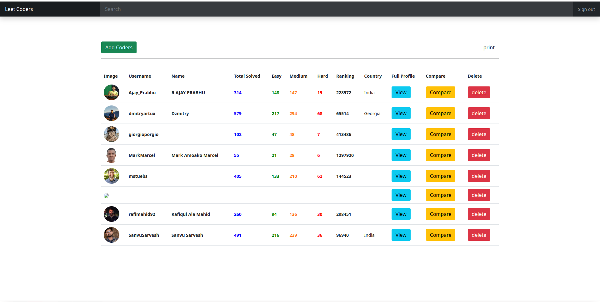
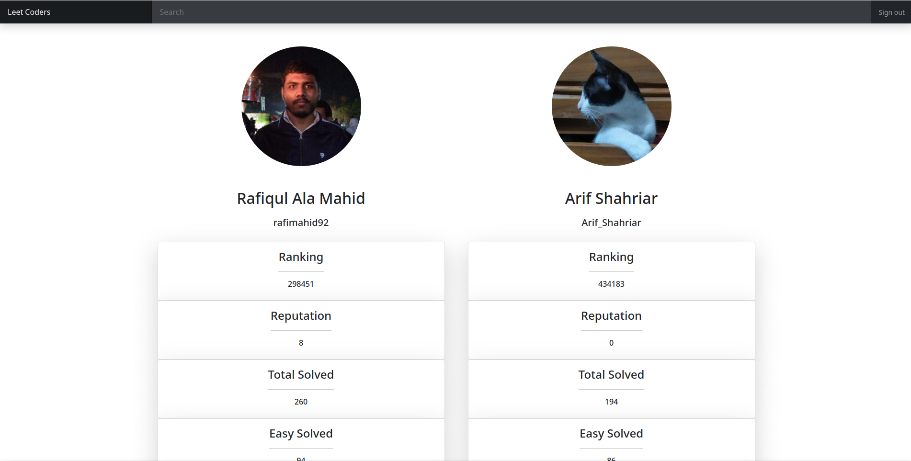
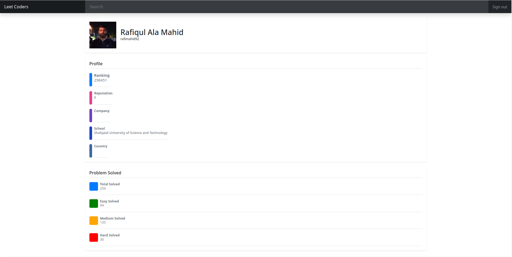

# Leet-Coders

Leet-Coders is a leetcode users' states showing webapp, where an user can create account, add his choosen users in the friend list and can view their profile data. User can compare their profile with others through this app.

### Features of this app

<p align = "center">


<p align ="center">
Home page of the app </p>

#### There are four options assembled in home page :

- Adding Leetcode users to the prefered list
- View their profile
- Compare their profile
- Delete users from the list

<p align = "center">

  
  <p align ="center">
Comparisn page </p>

#### In comparisn page, user can compare their profile with other.

<p align = "center">

  
  <p align ="center">
User's profile page </p>

### Installation

If you are using Manjaro operating system, then

#### Install Xampp

XAMPP is a free and open-source cross-platform web server solution stack package developed by Apache Friends, consisting mainly of the Apache HTTP Server, MariaDB database, and interpreters for scripts written in the PHP and Perl programming languages.
<a href = "https://www.apachefriends.org/"> Install XAMPP </a>

#### Clone and Configure project

- Clone the project
- Move the project to the following directory:

```
/opt/lampp/htdocs/
```

- Start XAMPP :

```
sudo /opt/lampp/lampp start
```

- Create Database:

```
CREATE DATABASE leetcode_states;
```

```
CREATE TABLE users (
    id INT PRIMARY KEY AUTO_INCREMENT,
    username VARCHAR(255) NOT NULL,
    author_username VARCHAR(255) NOT NULL,
    CONSTRAINT unique_username_authorname UNIQUE (username, author_name)
);
```

- Open browser and go to the url:

```
http://localhost/Leet-Coders
```
